# Instalation


### [Download](https://github.com/patarakaci/Upload.Drive.Api/releases/download/curl-v1.0/bash_driver_api.tar.gz) bash scripts and follow guide!
---

- Enter to Google console -> [link](https://console.cloud.google.com/)

- Choose Credentials -> Create Project
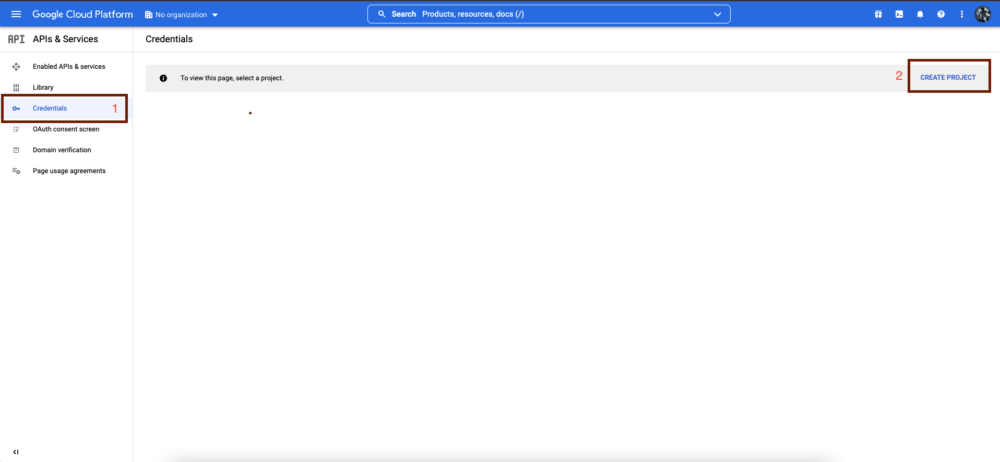
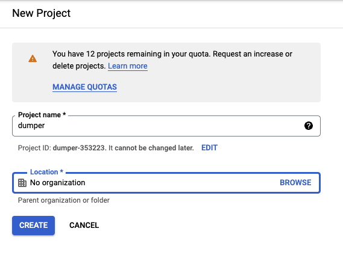


- Create Credentials -> OAuth client ID
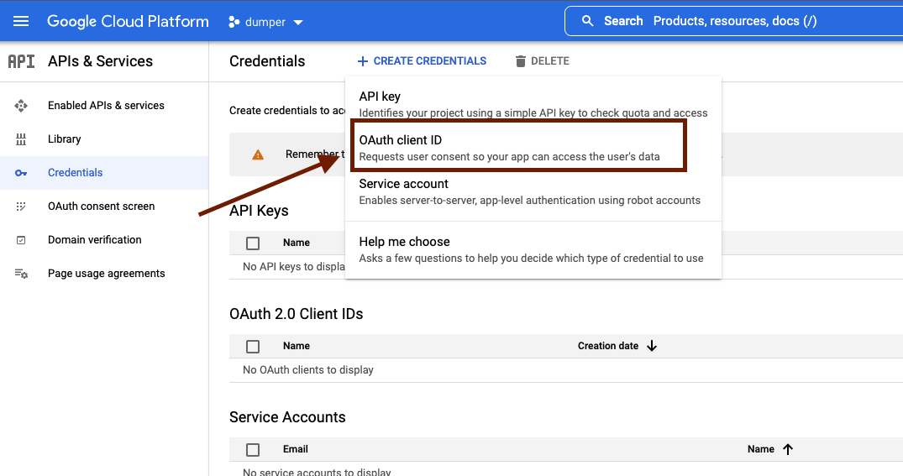


- Choose Configure Consent Screen -> Choose External
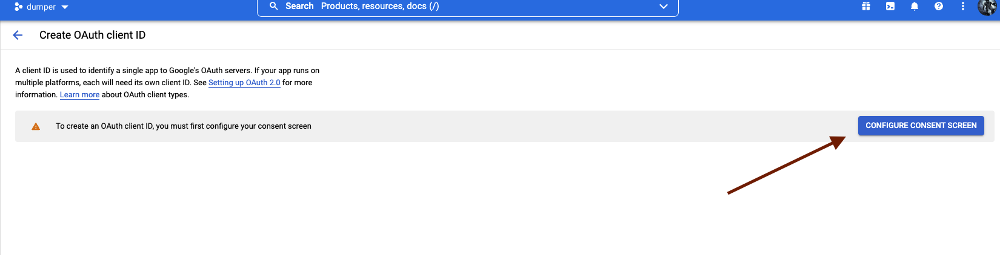
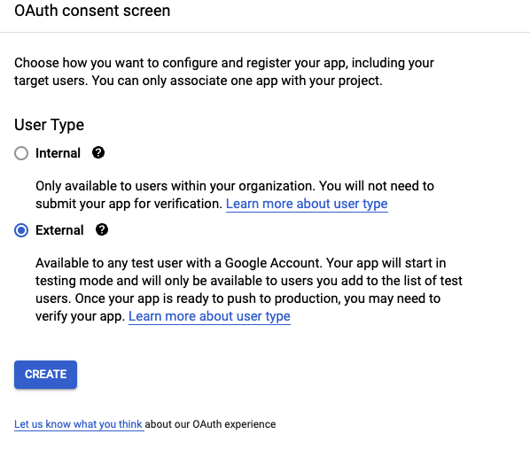


- Enter next values: App name; User support email; Email addresses. -> Save and continue

    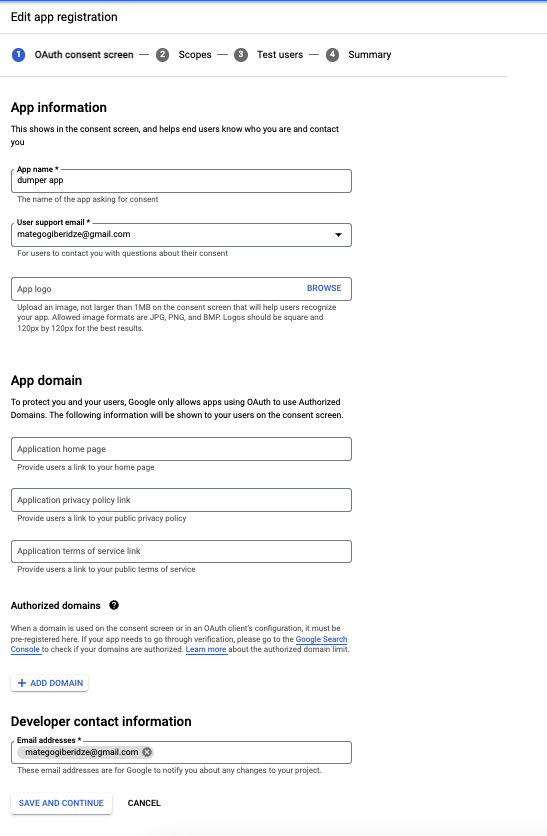


- Choose Add or remove scopes and mark all API-s (it is necessary ) -> Save and continue -> Save and continue -> Back to dashboard
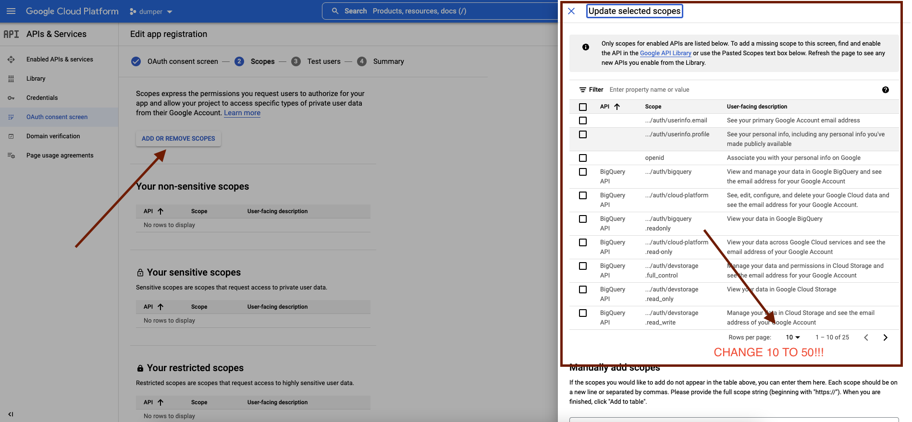


- Choose Credentials -> Create Credentials -> OAuth client ID -> choose "TVs and Limited Input Devices" -> Create

    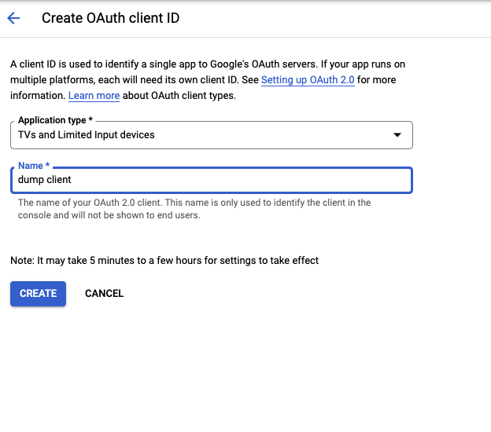

- On same [link](https://console.developers.google.com/) Choose Enabled APIs and Services -> ENABLE APIS AND SERVICES
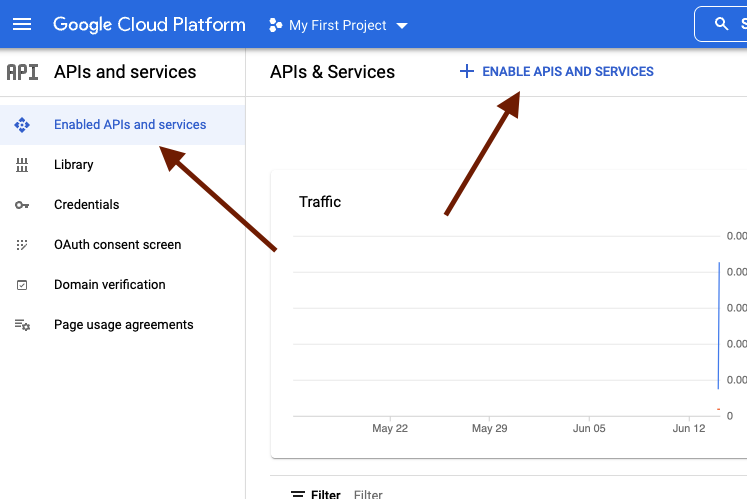

- Search Google Driver API -> Enable

    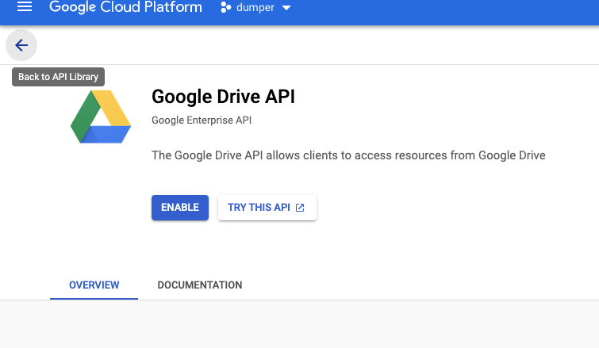

---
# Usage
- run firstly main_api_upload.sh script.
    ```bash
    bash /path/main_api_upload.sh
    ```
- input Client ID and Client Secret

    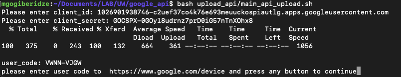 
- visit [Google device link](https://www.google.com/device) and input User Code which is outputed by script
- command to make cronjob
    ```bash
    crontab -e
    ``` 
- then write bellow command to crontab for refresh token in every 15 minuntes!
    ```
    */15 * * * * bash /path/refresh_token.sh
    ```
- last step is run updated mysqldbdump-bash.sh script